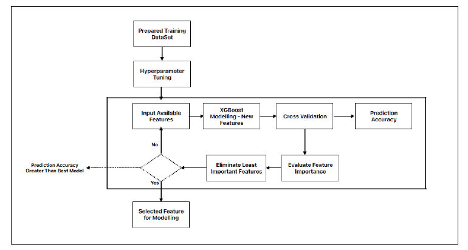
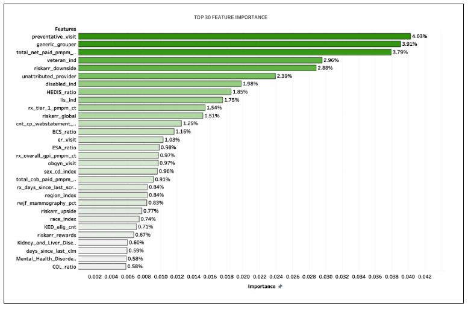
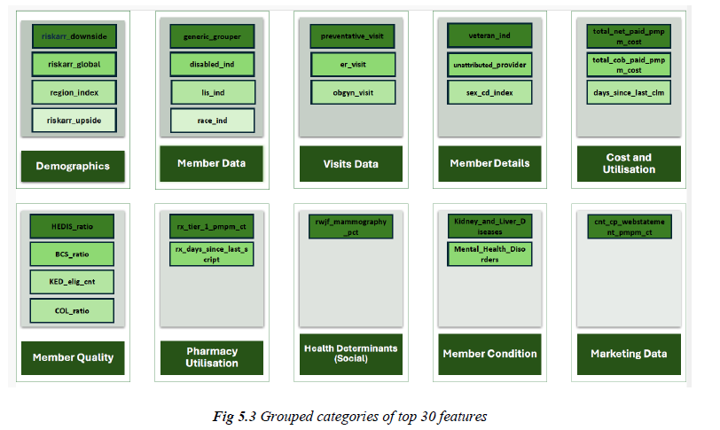
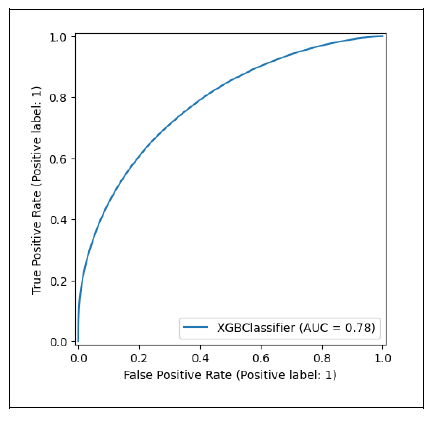
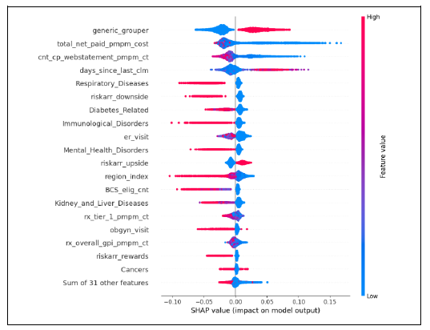

# 🩺 Enhancing Preventive Care in Healthcare Systems Using Data-Driven Approaches 🚀

Welcome to the **Humana-Mays Healthcare Analytics Competition 2024** project! This initiative focuses on addressing the challenge of low engagement in preventive care among Humana’s Local Preferred Provider Organization (LPPO) plan members. By leveraging advanced machine learning techniques and data-driven insights, we aim to improve member health outcomes and Humana’s financial sustainability.

---

## 🌟 Project Overview

This project involved designing and implementing an **end-to-end predictive model** to identify gaps in preventive care engagement. Using **XGBoost**, we achieved an **AUC-ROC score of 0.782**, demonstrating strong predictive performance. Additionally, we utilized **SHAP (SHapley Additive exPlanations)** for model interpretability, providing actionable insights into the key drivers of preventive care engagement.

---

## 🔑 Key Features

- **📊 Predictive Modeling**: Developed an XGBoost model to predict preventive care gaps among Humana LPPO members.
- **🔧 Feature Engineering**: Created new features like compliance ratios, year-over-year visit ratios, and aggregated member-level data to enhance model performance.
- **🎯 Hyperparameter Tuning**: Conducted hyperparameter optimization using **Random Search** to fine-tune the model.
- **🔍 Model Interpretability**: Used **SHAP visualizations** (beeswarm and bar plots) to interpret model predictions and identify key factors influencing preventive care engagement.
- **📈 Data-Driven Recommendations**: Provided actionable strategies to engage underserved groups, including low-cost members, disabled veterans, and members with long gaps since their last claim.

---

## 🗂️ Project Structure

The project is organized into the following sections:

1. **📄 Executive Summary**: Overview of the problem, objectives, and key recommendations.
2. **📋 Case Context**: Detailed understanding of preventive care engagement challenges in Humana’s LPPO plans.
3. **📊 Data Understanding**: Exploration and aggregation of the dataset, including member demographics, claims, and quality metrics.
4. **🧹 Data Preparation**: Feature engineering, data imputation, and preprocessing steps.
5. **📊 Statistical Analysis and Modeling**: Model selection, hyperparameter tuning, and evaluation metrics.
6. **🔍 Model Interpretation**: Insights from SHAP analysis and feature importance rankings.
7. **💡 Business Implications and Recommendations**: Tailored strategies to improve preventive care engagement.
8. **🔮 Future Scope**: Suggestions for incorporating additional data sources and advanced techniques like NLP and geospatial analysis.

---

## 🔍 Key Findings

- **💸 Low-Cost Members**: Members with lower healthcare costs and prescription usage were least likely to attend preventive visits.
- **🎖️ Veterans and Disabled Individuals**: Veterans, especially those with disabilities, showed the largest preventive care gaps.
- **⏳ Long Gaps Since Last Claim**: Members with longer gaps since their last claim were progressively less likely to engage in preventive care.
- **🏥 Unattributed Providers**: Members without an attributed healthcare provider had higher preventive care gaps.

---

## 🚀 Recommendations

1. **📲 Automated Outreach Campaigns**: Use SMS, email, and phone reminders to engage low-cost members.
2. **💊 Pharmacy Partnerships**: Collaborate with pharmacies to offer preventive services during prescription pickups.
3. **🎖️ Veteran-Specific Programs**: Develop tailored outreach programs for veterans, including in-home preventive screenings.
4. **💻 Digital Engagement Tools**: Implement SMS/email reminders and promote online scheduling to increase participation.
5. **💰 Incentives for High-Risk Members**: Offer waived copays and financial incentives to reduce barriers for high-risk individuals.

---

## 🛠️ Tools and Technologies

- **🐍 Programming Language**: Python
- **🤖 Machine Learning Framework**: XGBoost
- **🔍 Model Interpretability**: SHAP (SHapley Additive exPlanations)
- **📊 Data Visualization**: Tableau, Amazon QuickSight
- **☁️ Cloud Platforms**: AWS S3, AWS Glue, AWS SageMaker
- **🎯 Hyperparameter Tuning**: Random Search
- **🧹 Data Preprocessing**: Custom imputation techniques, feature aggregation

---

## 🏆 Competition Results

- Competed against **180+ teams** across the USA.
- Secured a **top 10 position** based on model scoring performance.

---

## 🔮 Future Scope

- **🌍 Geospatial Analysis**: Identify areas with limited healthcare access for targeted interventions.
- **🏠 Social Determinants of Health (SDOH)**: Incorporate SDOH data to better understand barriers to preventive care.
- **🗣️ Natural Language Processing (NLP)**: Analyze unstructured data (e.g., call center transcripts) to uncover additional insights.
- **🧠 Psychographic Data**: Explore member attitudes and preferences to personalize outreach strategies.

---

## 📚 References

- Chen, T., & Guestrin, C. (2016). XGBoost: A scalable tree boosting system.
- Lundberg, S. M., & Lee, S.-I. (2017). A unified approach to interpreting model predictions.
- Additional references are included in the full report.

---

## 🙌 Thank You!

Thank you for exploring this project! We hope our data-driven approach to enhancing preventive care provides valuable insights and inspires actionable strategies to improve healthcare outcomes. 🚀

---

## 📊 Model Development Process

### 🛠️ Preparation and Hyperparameter Tuning
  
**Process**:
1. **Prepared Training Dataset**: Aggregated and cleaned data for model training.
2. **Hyperparameter Tuning**: Used **Random Search** to optimize model parameters.
3. **Feature Selection**: Evaluated feature importance and eliminated less important features.

---

### 🔍 Top 30 Feature Importance
  
**Key Features**:
- **preventative_visit**: 2.96%
- **generic_grouper**: 2.88%
- **total_net_paid_pmpn...**: 1.36%
- **veteran_ind**: 1.85%
- **riskarr_downside**: 1.75%

---

### 📂 Grouped Categories of Top 30 Features
  
**Categories**:
- **Demographics**: Gender, race, disability status.
- **Member Data**: Pharmacy utilization, days since last claim.
- **Visits Data**: ER visits, OBGYN visits.
- **Cost and Utilization**: Total paid costs, referral data.

---

### 📈 ROC Curve (AUC = 0.78)
  
**Model Performance**:
- **AUC-ROC Score**: 0.78
- **True Positive Rate**: High predictive accuracy for identifying members at risk of missing preventive care.

---

### 🔍 SHAP Values for Feature Impact
  
**Insights**:
- **High Impact Features**: `generic_grouper`, `total_net_paid_pmpm_cost`, `days_since_last_clm`.
- **Low Impact Features**: Sum of 31 other features.

---

## 🙌 Thank You!

Thank you for exploring this project! We hope our data-driven approach to enhancing preventive care provides valuable insights and inspires actionable strategies to improve healthcare outcomes. 🚀
